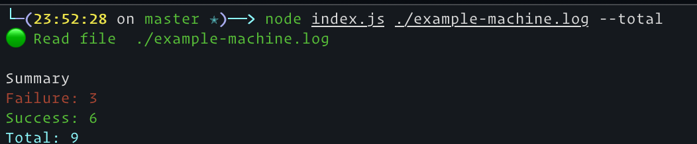
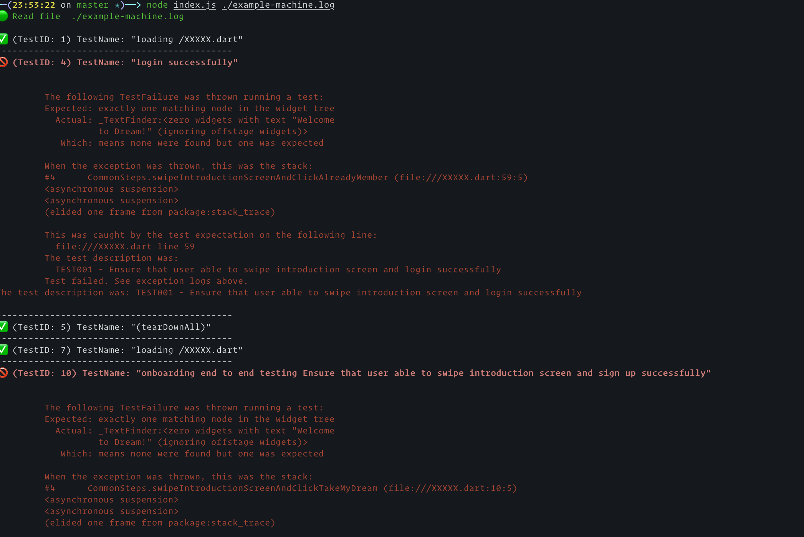

# Generate simple reports with nodejs from machine.log of flutter

`reference` : https://dev.to/apastuhov/make-dart-flutter-test-report-readable-2h0b

### **Problem**
<hr/>
I have a idea for transform test report readable simple for QA engineer for trace failure test
<br/>
<br/>

### **Solution**
<hr/>
Build script simple for read log file from run `flutter test --machine` my idea you can extend feature to `html reports` or add `ci-pipeline`
<br/>
<br/>

### **How to start**
<hr/>
```sh
> npm install or npm ci
> node index.js ./example-machine.log --total # log summary only
> node index.js ./example-machine.log # detail log each case
```
<br/>
<br/>

### **Simple Screenshot**
<hr/>



### **Detail Screenshot**
<hr/>



